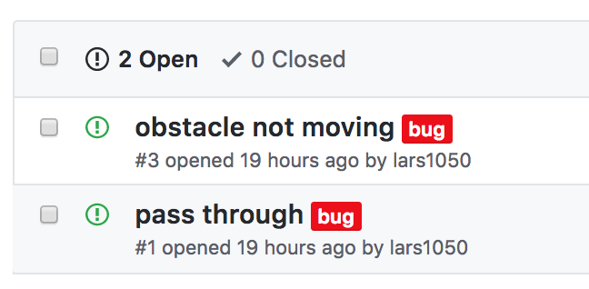

## HW06 [OPTIONAL]: Merging, Branching, and GitHub Issues

In this homework, you will change the structure of our development environment for Iteration 2. You will maintain multiple branches and use Github _Issues_ to track necessary changes and fixes to the code.

John Harwell, a veteran 3081W TA, has put together an informative guide on the use of git and branching, much of which was used to create this lab. It can be found in **_git-usage.pdf_**  in the _HW06_ folder.

### Git Branching and Merging (and other things!) Practice

First, to give you good practice with the technical aspects of merging, branching, and other Git tasks, the website below is a nice, interactive practice application. It will walk you through a variety of tasks, giving you some experience with the actions you'll be required to make in the project work to come. Consider completing the Introduction Sequence.

https://learngitbranching.js.org/

### Branching Model

In a general git workflow, such as most you will encounter in industry, the _master_ branch is not the general purpose development branch. Instead a number of other branches are used to perform development, and only pristine (i.e. working/release/etc) versions of the code are pushed to _master_.
For this class, we will be using the following branching model, which is inspired by http://nvie.com/posts/a-successful-git-branching-model.

#### Github Issues

As you develop your code, you will encounter a range of modifications that need to be made to the code, whether you are adding functionality, fixing it, or refactoring. More specifically, you might categorize the needed modifications as such:

| Category | Description |
|----------|-------------|
| Feature | An actual feature (i.e. adding new functionality to the code).
| Refactor | Refactoring existing code. Does not change behavior.
| Bug Fix | Fix a bug that was found in the code.
| Style | Updating/fixing code style (i.e. making it Google style compliant, for example).
| Doc | Adding/updating documentation for the code.
| Chore | Doing miscellaneous grunt work, such as file moving, renaming, etc.

Github provides a convenient and integrated method for keeping track of the needed modifications using _Issues_. As part of the development requirements of iteration 3, we expect that you will be using these Github issues, especially to track bugs in your code.

Below is an example of a list of bugs in a project:

<p align="center">  </p>

The process of **significant** code modification should start with the creation of an issue that has an appropriate label attached to it (in the example above, the label "bug" was used). The next step is to create a branch in which to address the issue.

#### Branch Titles and Types

- **master**: Always contains 100% functional, working code. Push to this branch only for releases. Anytime someone clones your repository and gets your master branch, they should *always* get a working version of code (even if it is not the most up-to-date, which could live on your _devel_ branch). For this class moving forward, the **master** branch will be limited to the submission of project iteration items (in our case, iteration 3 final submission). This branch always exists in a git repository, so you will never need to create it.

- **devel**: This is the main development branch, and also where all feature branches branch off of or get merged into. You rarely make changes directly in this branch, unless it is something trivial. For all consequential development work, a feature branch should be created off of _devel_ to contain the work. Branch off of _master_ at the start of a project, and never merge back into it, except for submitting project iteration items.

- **Feature Branches**: These are the branches that should contain the actual development work. They should be named something specific (i.e. not just feature/phase2, but feature/phase2-widgetA-scaffolding). Keep your commits on these branches focused on the issue and make relatively few, unless the complexity of the feature warrants more. Resist the temptation to follow multiple paths and address multiple issues on a single feature branch. Instead, open an issue in github to track what you have found/want to do (See [Github Issues](https://guides.github.com/features/issues/)), and continue on with the work of the feature branch.

> A "Feature" branch is an umbrella term for many types of modifications to the code. Other common reasons for creating a branch include refactoring, bug fixes, formatting, documentation, and general clean-up.

#### Branch Names

When creating a new branch, you want the title to be easily associated with the issue it will address. It should contain the issue number, as well as a short description, possibly using the categories of modification listed above.

Notice in the image above that the "pass through" bug is issue \#1. To address it, you would make a branch from devel with an appropriate title, such as _fix/01-entity-pass-through-entity_. You might prefer different wording, but **the important part is that it has the issue number in the title** and the name is meaningful.

> Note that you should probably only work on one branch at a time so that you aren't trying to merge multiple branches into one. Create as many issues as is needed to track everything, but try to address only 1 at a time.

<hr>


### Getting Started with devel

**Start preparing your repo by creating the _devel_ branch.**  If your local repo differs from the server, you should commit and push before creating a new branch. In your `repo-<username>` repo:

```
git checkout -b devel
git push --all origin
git checkout master
git branch
git checkout devel
git branch
```

`git checkout` is the command to change your local directory/repo to reflect the code in the branch you are checking out. By adding the flag `-b`, you are creating a new branch with the name that follows. This will be an exact copy of whatever is currently in your local repo. Now any modifications that you make in this new branch will stay in the branch until you merge it with another one.

Branches have to be pushed to the repo to be available to others (and to you on another machine). For the first push, you have to specify where the branch needs to go. (If you do `push` without the added flag, git will tell you exactly what you need to type to push to the server.) Once you have done this initial command, only `git push` will be needed.

After you have pushed the branch, you can move between branches using checkout. Above, we had you create the branch, move back to the master, then move back to devel. Notice how seamless this is in your local repo. You don't have to rename anything or make any copies. Git will replace the entire directory for you to reflect the state of that branch.

`git branch` provides you with a list of all branches and identifies which one you are currently on. Notice the switch between branches during the commands above.

<hr>

### Creating an Issue

Go to your project repo on Github and create an issue. For this example, use any currently known bug in your project that won't take long to fix (maybe a typo or some similarly trivial fix). When you create this issue, label it with "bug" (from the pull down menu) and let's pretend that you added this issue when you first encountered it, therefore you provided additional information. In the comment of the issue add some descriptive information about what you're doing and why.

In general when you create an issue for a bug for this iteration, you need to provide this type of documentation in which you describe the bug, how to repeat it, where is the likely cause, and what you think is the cause.

<hr>

### Branch for Issues

**Confirm you are on the devel branch.**

Make a new branch with the name as specified below (if the bug issue is \#1, otherwise use its issue number). The entire string `fix/01-short description of bug>` is the name of the branch.

```
git checkout -b fix/01-<short description of bug>
git push --all origin
```

Go to Github and click on the _Branch_ pulldown menu in the upper left to see your branch added to the list. If you select it, it will switch the visible content to the content of that branch.

### Fix the Bug

Make changes to the project code to fix the bug.

Now compile! You don't want to merge your changes back into devel until it compiles.

If everything is working, let's commit (WAIT, read the next section before you do this!!!!).

<hr>


### Commit Messages

As part of good documentation, it is important to record how the code was modified from the last commit. The git usage document outlines a template and offers a few examples. To make a more substantial commit, you need to **NOT** use the `-m` flag so that your configured editor opens for you to edit.

>The default editor is vim. If you want another editor, see the git usage document for how to change that.

Start the commit process with the following (which assumes the only changed files are those you wish to commit. If that is not the case, the _git add *_ command below should be modified so only the files you intend to commit are added):

```
git add *
git commit
```

When you do this, you will notice a series of lines preceded by \# that include very useful information about the status of your repo. These will not be included in your commit message.

Now you want to add the short message at the top, as well as some more extensive comments underneath that.

```
fix(#1): fix <short description of commit>

- Multiple lines of description
- Lists all the important elements that have been changed
- etc.
```

The general style is to list the type of modification, in parentheses list the issue number (or the changed files, if not related to an issue), then provide a short description of the change. The lines that follow provide specifics. Notice the \#1 in the message. When you use the issue number with the pound sign in the message, Github recognizes and adds the commit message as a comment to the issue creating a link between the issue and any related commits and branches. More on this [here](https://help.github.com/articles/closing-issues-using-keywords/).

Save and close your editor. Now push ...

```
git push --set-upstream origin fix/01-entities-pass-through-entities
```

> The template provided in the git usage document can be added to git so that when the editor opens, you will see that content. To add the template, save it as a file (_~/.gitmessage_ is the convention) and add to your git configuration:
```
git config --global commit.template ~/.gitmessage
```

<hr>

### Merge with devel

If you are satisfied with the results, you want to merge this branch with _devel_ (not with _master_). You can do this in 2 ways. If you want to take a trial run or if someone else is in control of merging branches, you can submit a _pull request_. This is a request to pull in your position branch into the devel branch. You can do this from the Github interface under Pull Requests. Then you can _accept_ the pull request to merge the branches. **Make sure your pull request is into the _devel_ branch - select from the pulldown menus.**

Command line is easier and faster, although the pull request will give you more information about the impact of the merge.

```
git checkout devel
git merge --no-ff fix/01-<short description of bug>
git push
```

The _--no-ff_ option tells git not to do a fast forward merge, and actually create a merge object, which is just a technical way of saying making it easier to roll back changes that break things.

> **Always** branch off of _devel_ and **always** merge back into it.

Go to Github and click on the issue. Notice that the commit has been added to it. Close this issue by clicking on the _Close issue_ button at the bottom.

We would normally suggest that you delete the branch, but then we won't be able to see your history of using branches. For the purposes of this project (so the graders can easily see your progress and work), please keep your branches.

<hr>

#### Parting Thoughts

Keep in mind that the issues are there to remind you what needs doing and fixing. This means that you use it like a todo list, writing things down as they occur to you.

It probably took you awhile in this homework to add the issue, make the branch, then merge it back into devel after the changes were made. This will go very quickly once you get in the habit, and we think you will eventually appreciate the documentation of the changes that have been made and the ones that still need to be made.

If you are addressing one of the primary iteration requirements, follow this full process of issues and branching (and it might involve multiple issues and branches). But you don't have to do this _every_ time you make a change! If you have something minor -- skip making an issue, make the change in the devel branch, and use the command line for commit messages. The important part is to be consistent.
